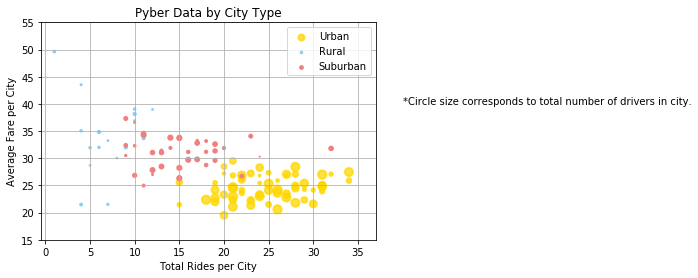
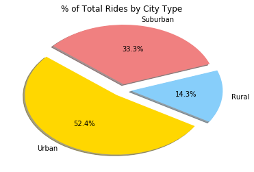
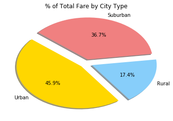
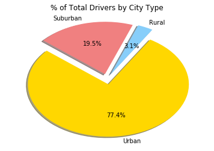

```python
# Import dependencies
import pandas as pd
import numpy as np
from matplotlib import pyplot as plt
```


```python
# Set file paths
city_path = 'raw_data/city_data.csv'
ride_path = 'raw_data/ride_data.csv'

# Read CSVs into data frames
city_df = pd.read_csv(city_path)
ride_df = pd.read_csv(ride_path)
ride_df.head()
```


<div>
<style scoped>
    .dataframe tbody tr th:only-of-type {
        vertical-align: middle;
    }

    .dataframe tbody tr th {
        vertical-align: top;
    }

    .dataframe thead th {
        text-align: right;
    }
</style>
<table border="1" class="dataframe">
  <thead>
    <tr style="text-align: right;">
      <th></th>
      <th>city</th>
      <th>date</th>
      <th>fare</th>
      <th>ride_id</th>
    </tr>
  </thead>
  <tbody>
    <tr>
      <th>0</th>
      <td>Sarabury</td>
      <td>2016-01-16 13:49:27</td>
      <td>38.35</td>
      <td>5403689035038</td>
    </tr>
    <tr>
      <th>1</th>
      <td>South Roy</td>
      <td>2016-01-02 18:42:34</td>
      <td>17.49</td>
      <td>4036272335942</td>
    </tr>
    <tr>
      <th>2</th>
      <td>Wiseborough</td>
      <td>2016-01-21 17:35:29</td>
      <td>44.18</td>
      <td>3645042422587</td>
    </tr>
    <tr>
      <th>3</th>
      <td>Spencertown</td>
      <td>2016-07-31 14:53:22</td>
      <td>6.87</td>
      <td>2242596575892</td>
    </tr>
    <tr>
      <th>4</th>
      <td>Nguyenbury</td>
      <td>2016-07-09 04:42:44</td>
      <td>6.28</td>
      <td>1543057793673</td>
    </tr>
  </tbody>
</table>
</div>


```python
# Average fare per city
rides_group = ride_df.groupby("city", as_index=False)
avg_fare_city = rides_group["fare"].mean()

# Total number of rides per city
tot_rides_city = rides_group.count()
tot_rides_city = tot_rides_city.drop(["date", "ride_id"], axis=1)
tot_rides_city = tot_rides_city.rename(columns={"fare":"Count of Rides"})

# Total number of drivers per city
cities_group = city_df.groupby("city", as_index=False)
drivers_per_city = cities_group["driver_count"].sum()
```


```python
# Combine fields into data frames

# first drop driver count from groupby object
city_type = city_df.drop(["driver_count"], axis=1)

# df1
plot_df1 = pd.merge(avg_fare_city, tot_rides_city, how='outer')

#df2
plot_df2 = pd.merge(drivers_per_city, city_type, how='outer')

# Combined df
plot_df = pd.merge(plot_df1, plot_df2, how='outer', on='city')

# rename column
plot_df = plot_df.rename(columns={"type": "City Type", 
                                  "city":"City",
                                  "fare":"Fare",
                                  "driver_count": "Count of Drivers",
})

plot_df.head()
```


<div>
<style scoped>
    .dataframe tbody tr th:only-of-type {
        vertical-align: middle;
    }

    .dataframe tbody tr th {
        vertical-align: top;
    }

    .dataframe thead th {
        text-align: right;
    }
</style>
<table border="1" class="dataframe">
  <thead>
    <tr style="text-align: right;">
      <th></th>
      <th>City</th>
      <th>Fare</th>
      <th>Count of Rides</th>
      <th>Count of Drivers</th>
      <th>City Type</th>
    </tr>
  </thead>
  <tbody>
    <tr>
      <th>0</th>
      <td>Alvarezhaven</td>
      <td>23.93</td>
      <td>31</td>
      <td>21</td>
      <td>Urban</td>
    </tr>
    <tr>
      <th>1</th>
      <td>Alyssaberg</td>
      <td>20.61</td>
      <td>26</td>
      <td>67</td>
      <td>Urban</td>
    </tr>
    <tr>
      <th>2</th>
      <td>Anitamouth</td>
      <td>37.32</td>
      <td>9</td>
      <td>16</td>
      <td>Suburban</td>
    </tr>
    <tr>
      <th>3</th>
      <td>Antoniomouth</td>
      <td>23.62</td>
      <td>22</td>
      <td>21</td>
      <td>Urban</td>
    </tr>
    <tr>
      <th>4</th>
      <td>Aprilchester</td>
      <td>21.98</td>
      <td>19</td>
      <td>49</td>
      <td>Urban</td>
    </tr>
  </tbody>
</table>
</div>


```python
# categorize data into new data frames by city type

# Urban
urban_df = plot_df.loc[plot_df["City Type"]=='Urban', :]

# Suburban
suburban_df = plot_df.loc[plot_df["City Type"]=='Suburban', :]

# Rural
rural_df = plot_df.loc[plot_df["City Type"]=='Rural', :]
```


```python
fig, ax = plt.subplots()
plt.scatter(x=urban_df['Count of Rides'], y=urban_df['Fare'], c='gold', alpha=0.75, s=urban_df['Count of Drivers'],label='Urban', linewidths=2)
plt.scatter(x=rural_df['Count of Rides'], y=rural_df['Fare'], c='lightskyblue', alpha=1, s=rural_df['Count of Drivers'], label='Rural')
plt.scatter(x=suburban_df['Count of Rides'], y=suburban_df['Fare'], c='lightcoral', alpha=1, s=suburban_df['Count of Drivers'], label='Suburban')
plt.legend(loc='best')
plt.xlabel("Total Rides per City")
plt.ylabel("Average Fare per City")
plt.title("Pyber Data by City Type")
plt.xlim(-0.5, 37)
plt.ylim(15, 55)
plt.text(40, 40, '*Circle size corresponds to total number of drivers in city.')
plt.grid()
plt.show()
```





```python
# Pie charts

# % of Total Rides by City Type
labels = ['Urban', 'Rural', 'Suburban']
sizes = [len(urban_df), len(rural_df), len(suburban_df)]
colors = ['gold', 'lightskyblue', 'lightcoral']
explode = [0.1, 0.1, 0.1]
plt.pie(sizes, explode=explode, labels=labels, colors=colors,
        autopct="%1.1f%%", shadow=True, startangle=140)
plt.title("% of Total Rides by City Type")
plt.show()
```





```python
# % of Fare by City Type

labels = ['Urban', 'Rural', 'Suburban']
sizes = [urban_df["Fare"].sum(), rural_df["Fare"].sum(), suburban_df["Fare"].sum()]
colors = ['gold', 'lightskyblue', 'lightcoral']
explode = [0.1, 0.1, 0.1]
plt.pie(sizes, explode=explode, labels=labels, colors=colors,
        autopct="%1.1f%%", shadow=True, startangle=140)
plt.title("% of Total Fare by City Type")
plt.show()
```





```python
# % of Fare by City Type

labels = ['Urban', 'Rural', 'Suburban']
sizes = [urban_df["Count of Drivers"].sum(), rural_df["Count of Drivers"].sum(), suburban_df["Count of Drivers"].sum()]
colors = ['gold', 'lightskyblue', 'lightcoral']
explode = [0.1, 0.1, 0.1]
plt.pie(sizes, explode=explode, labels=labels, colors=colors,
        autopct="%1.1f%%", shadow=True, startangle=140)
plt.title("% of Total Drivers by City Type")
plt.show()
```




